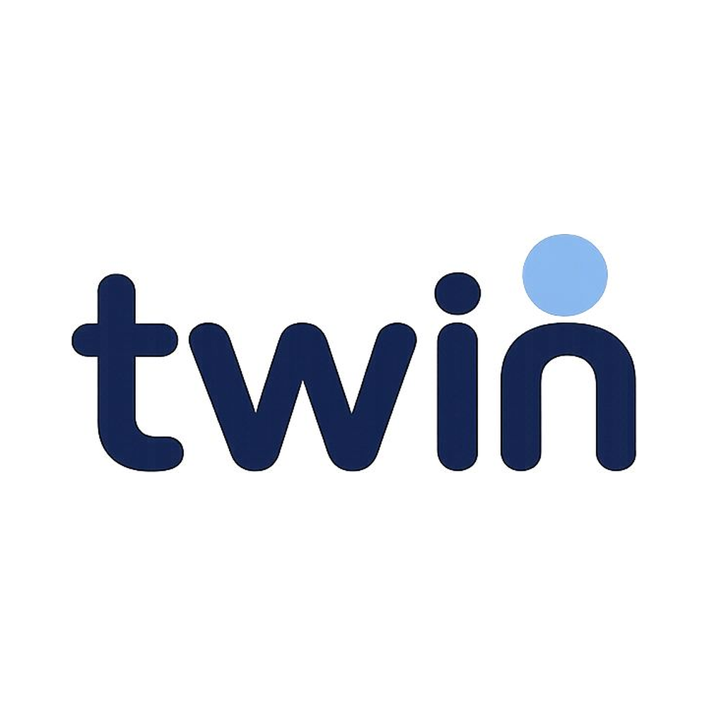

# Twin Protocol



**Track:** 🛸 Future · **Equipo 11 · Platanus Hack 26 (Buenos Aires)**

- Nicolás Priotto · [@nicopriotto](https://github.com/nicopriotto)
- Manuel Ahumada · [@maahumada](https://github.com/maahumada)
- Juan Ignacio Lategana · [@JuaniGit](https://github.com/JuaniGit)
- Josefina Gonzalez Cornet · [@jgonzalezcornet](https://github.com/jgonzalezcornet)

---

## TL;DR

> **"Login con Google" pero para tu personalidad.**

Twin es un **protocolo de identidad personal portable**: cada persona crea una representación AI de sí misma —gustos, hábitos, vibras, estilo de comunicación— mediante entrevistas de voz cortas. Las aplicaciones de terceros se integran con un botón `Connect your Twin` (flujo tipo OAuth), piden scopes específicos, y a partir de ahí pueden consultar al Twin vía API REST para personalizar su experiencia **desde el primer click**.

El usuario controla en todo momento qué apps pueden consultar qué dominios, qué consultas hicieron y puede revocar acceso a cualquiera. La idea no es construir otro chatbot — es construir la **infraestructura** para que el contexto del usuario deje de ser un silo cerrado en cada plataforma.

> Así como hoy uno hace "Login con Google", la apuesta es que mañana sea "Login con Twin": al conectarte, tu Twin expone una API que las plataformas usan para adaptar su producto, contenido e interfaz al usuario que recién se registra.

> Demo end-to-end con una app mock construida para esta demo: **Buholingo**, una plataforma de aprendizaje de idiomas (estilo Duolingo) que conecta el Twin para personalizar las lecciones según los gustos y vibras del usuario.

Tesis larga, decisiones arquitectónicas, scopes, dominios y modelo de datos completo en [`IDEA.md`](./IDEA.md). Catálogo de constantes (scopes, dominios, intents, curriculum, providers) en [`DEFINITIONS.md`](./DEFINITIONS.md).

---

## Tabla de contenidos

1. [Problema y tesis](#problema-y-tesis)
2. [Cómo funciona](#cómo-funciona)
3. [Arquitectura](#arquitectura)
4. [Stack técnico](#stack-técnico)
5. [Modelo de datos](#modelo-de-datos)
6. [Twin Query API](#twin-query-api)
7. [Connect Flow (OAuth-like)](#connect-flow-oauth-like)
8. [Permission engine](#permission-engine)
9. [Sesiones de entrenamiento (voice agents)](#sesiones-de-entrenamiento-voice-agents)
10. [Estado de implementación](#estado-de-implementación)
11. [Cómo correrlo localmente](#cómo-correrlo-localmente)
12. [Demo paths](#demo-paths)
13. [App de demo: Buholingo](#app-de-demo-buholingo)
14. [Por qué cada criterio](#por-qué-cada-criterio)

---

## Problema y tesis

Hoy cada plataforma tiene que aprender quién sos desde cero: configurás preferencias, llenás formularios, entrenás algoritmos a click hasta que la app entiende tus gustos. Spotify conoce tu música, Mercado Libre tus compras, Instagram tus intereses, ChatGPT parte de tu contexto, pero **no existe una representación portable y controlada de vos** que las apps puedan consultar.

Las experiencias del futuro van a estar mediadas por agentes y van a ser profundamente personalizadas. Para eso, las apps necesitan entender al usuario. Hay mucha inversión hoy en MCPs y APIs para que **agentes puedan usar software**, pero falta el otro lado: **que los agentes y aplicaciones realmente entiendan a la persona detrás del usuario**.

> Así como OAuth permite que una app acceda a tu identidad sin pedirte tu contraseña, Twin permite que una app acceda a tu **contexto personal** sin tener que poseer tus datos ni inferirlos desde cero.

---

## Cómo funciona

### 1. El usuario crea su Twin

El usuario se registra y entrena su Twin mediante un **curriculum de 8 sesiones de voz de ~15 minutos** (~2h totales). El diseño está inspirado en el paper de Stanford / Google DeepMind [*"Generative Agent Simulations of 1,000 People"*](https://arxiv.org/abs/2411.10109), que demostró que con 2 horas de entrevista alcanzan para que un agente prediga las respuestas del entrevistado con **85% de precisión** sobre tests posteriores (GSS, BFI, juegos económicos).

Cada sesión:
- Tiene un **target domain** (vibes, music_taste, event_preferences, etc.) asignado por el slot del curriculum.
- Las preguntas las **genera el LLM en runtime** (no hay banco fijo) en base al estado actual del Twin + el slot.
- Al cerrar: extracción de facts → update de `twin_skills` (con confidence per-fact) → recálculo de `completion_score` → avance de `next_session_index` → regeneración del summary.

El Twin es una **entidad estructurada en Postgres**, no un modelo fine-tuned. Esto evita infraestructura ML pesada y mantiene el conocimiento auditable y editable.

### 2. Aplicaciones externas se conectan

Una app de terceros (ej. **Buholingo** — la app mock de aprendizaje de idiomas que armamos para la demo) integra un botón:

```html
<a href="https://twin.app/connect?app_id=buholingo&redirect_uri=...">
  Connect your Twin
</a>
```

El usuario es redirigido a un **hosted consent screen** controlado por Twin Protocol. Acepta los scopes, se crea una `app_connection`, y la app recibe un `connection_id + access_token` (SHA-256 hasheado en DB; el raw nunca se persiste).

### 3. La app consulta la Twin API

```
POST /api/twin/query
Authorization: Bearer <access_token>
{
  "connection_id": "conn_abc123",
  "intent": "event_ranking",
  "context": { "events": [ ... ] }
}
```

Twin valida scopes, ejecuta el intent contra el contexto del Twin (vía Claude Sonnet 4.6), y responde con respuesta estructurada + confidence + reasons + el objeto `policy` que dice qué scopes se usaron.

### 4. El usuario audita y controla

En `Aplicaciones`, el usuario ve cada app conectada, qué scopes tiene, qué consultas hizo recientemente, y puede revocar la conexión con un click. Las consultas bloqueadas (por scope insuficiente o dominio sensible) también quedan logueadas para transparencia.

> Como el Twin se entrena con sesiones cortas y frecuentes, se mantiene siempre actualizado sin reentrenarlo de cero — cada nueva conversación afina los facts existentes y suma los nuevos.

---

## Arquitectura

```
┌────────────────────────── Twin Protocol (Next.js fullstack) ──────────────────────────┐
│                                                                                       │
│  ┌──────────────┐  ┌─────────────────┐  ┌────────────────┐  ┌─────────────────────┐   │
│  │  Landing     │  │ Auth (Supabase) │  │  Dashboard     │  │  Connect (hosted)   │   │
│  │  /(public)   │  │  /auth/*        │  │  /(platform)   │  │  /(connect)         │   │
│  └──────────────┘  └─────────────────┘  └────────────────┘  └─────────────────────┘   │
│                                                                                       │
│  ┌─────────────────────────── /api ────────────────────────────────────────────────┐  │
│  │  /api/twin/query    →  4 intents (event_recommendation, event_ranking,          │  │
│  │                         domain_summary, general_summary)                        │  │
│  │  /api/connect/*     →  consent → token issuance → revoke                        │  │
│  │  /api/sessions/*    →  poll de sesión post-end (facts pipeline)                 │  │
│  │  /api/livekit/*     →  token mint para sesiones (server-issued)                 │  │
│  │  /api/training/*    →  start session                                            │  │
│  │  /api/chat/*        →  conversación libre con el Twin (post-MVP)                │  │
│  └─────────────────────────────────────────────────────────────────────────────────┘  │
│                                                                                       │
│  Permission engine  ┌──────────── lib/query ─────────────┐                            │
│  lib/permissions    │  intents/event-ranking.ts          │   ┌────────────────┐       │
│  lib/connect        │  intents/event-recommendation.ts   │──▶│ Anthropic API  │       │
│                     │  intents/domain-summary.ts         │   │ Claude 4.6     │       │
│                     │  intents/general-summary.ts        │   └────────────────┘       │
│                     │  twin-context.ts (DB → prompt)     │                            │
│                     │  log.ts (query_logs)               │                            │
│                     └────────────────────────────────────┘                            │
│                                                                                       │
└────────────┬───────────────────────────────────────────────────────────────┬──────────┘
             │                                                               │
             ▼                                                               ▼
   ┌─────────────────────┐                                       ┌────────────────────────┐
   │   Supabase          │                                       │  LiveKit Worker        │
   │   - Postgres        │                                       │  (Node, proceso aparte)│
   │   - Auth            │                                       │  - Deepgram Nova-3 STT │
   │   - RLS policies    │                                       │  - Claude 4.6          │
   └─────────────────────┘                                       │  - ElevenLabs Flash    │
                                                                 │  - Beyond Presence     │
                                                                 │    (avatar Nelly)      │
                                                                 └────────────────────────┘
```

**Decisión clave**: todo Next.js fullstack en un solo proyecto (front + API). La única excepción es el **worker LiveKit Agents** que corre como proceso Node separado (necesita websockets long-running, no entra en Vercel functions). En dev son 2 procesos (`pnpm dev` + `pnpm worker`); en prod, Twin va a Vercel y el worker a Render/Fly.io.

---

## Stack técnico

| Capa | Tech |
|---|---|
| **Framework** | Next.js 16 (App Router, TypeScript estricto, Server Components + Server Actions) |
| **Auth + DB** | Supabase (Postgres con RLS por usuario, Supabase Auth con email + password) |
| **LLM** | **Claude Sonnet 4.6** vía `@anthropic-ai/sdk`, con un adapter custom para `@livekit/agents` (`worker/anthropic-llm.ts`) |
| **Voice agents** | LiveKit Cloud + `@livekit/agents` (Node worker) |
| **STT** | Deepgram Nova-3 |
| **TTS** | ElevenLabs Flash v2.5 (voz argentina, latencia <300ms) |
| **Avatar** | Beyond Presence (`@livekit/agents-plugin-bey`) — avatar foto-realista server-rendered, publicado como video track WebRTC. Avatar default: **Nelly** |
| **UI** | Tailwind v4 + shadcn/ui + Lucide icons + DiceBear (avatares 2D del perfil de usuario) |
| **Validación** | Zod en server actions y request bodies de la API |
| **Tests** | Vitest (~50 unit tests sobre permission engine, recompute de skills, intents, prompts) |
| **Hosting** | Vercel (Twin + Buholingo, mismo proyecto) · Render/Fly.io (worker LiveKit) · Supabase Cloud (DB + Auth) |

---

## Modelo de datos

7 tablas en `public`. Migrations en `supabase/migrations/`.

```
users               id, email, name, avatar_url
twins               id, user_id, name, completion_score, summary,
                    profile_json, next_session_index (0..12)
twin_skills         id, twin_id, domain, confidence, facts_json
                    └─ facts_json: [{ id, text, confidence, source_session_id, ... }]
sessions            id, twin_id, type ('training' | 'chat'),
                    domain, transcript_json, summary, extracted_facts_json,
                    session_index, target_domains_json, duration_seconds,
                    started_at, ended_at
twin_skill_edits    id, user_id, twin_id, domain, action ('add' | 'remove' | 'edit'),
                    fact_before, fact_after, reason
developer_apps      id, name, client_id, client_secret_hash,
                    redirect_uris_json, allowed_scopes_json
app_connections     id, user_id, twin_id, app_id, scopes_json, status,
                    access_token_hash (SHA-256), revoked_at
query_logs          id, connection_id, user_id, app_id, intent, question,
                    response_summary, allowed, blocked_reason, scopes_used_json
```

**Highlights del diseño:**

- **`twin_skills` es la fuente de verdad**, no `twins.profile_json`. Cada fact tiene su propia confidence; la del dominio es la media. Esto permite borrar/corregir un fact sin tocar el resto.
- **Tokens nunca se persisten en raw**: solo `SHA-256(access_token)` queda en DB. La revocación es soft delete (status + `revoked_at`) para preservar audit trail.
- **`communication_style` se deriva** de los transcripts de las otras sesiones — no tiene slot dedicado en el curriculum.
- **RLS habilitado** sobre todas las tablas: cada usuario solo accede a sus propias filas vía `auth.uid()`.

Trigger `handle_new_user` (en migration 0005) crea automáticamente la fila `twins` con `name = 'Twin de <nombre>'` cada vez que alguien se registra en `auth.users`.

---

## Twin Query API

Un único endpoint con múltiples `intent`. Diseñado para que **la app externa nunca acceda a datos crudos** del usuario — solo hace preguntas estructuradas y recibe respuestas con confidence + reasons.

```
POST /api/twin/query
Authorization: Bearer <access_token>
Content-Type: application/json
```

### Intents soportados (4)

| Intent | Scopes requeridos | Caso de uso |
|---|---|---|
| `general_summary` | `persona.read.summary` | Pitch del usuario en 1 párrafo |
| `domain_summary` | `persona.read.<domain>` | Dump estructurado de un dominio |
| `event_recommendation` | `persona.read.music` + `persona.read.events` + `persona.ask.recommendation` | "¿Le gustaría este evento?" |
| `event_ranking` | mismo conjunto | Reordenar una lista de eventos por afinidad |

### Ejemplo: `event_ranking`

**Request:**
```json
{
  "connection_id": "conn_abc123",
  "intent": "event_ranking",
  "context": {
    "events": [
      { "id": "e1", "artist": "Tormenta Negra", "genres": ["indie", "rock"], "venue_size": "intimate" },
      { "id": "e2", "artist": "Pop Night Live", "genres": ["pop"],          "venue_size": "arena" }
    ]
  }
}
```

**Response:**
```json
{
  "ranking": [
    { "id": "e1", "score": 0.87, "match": "strong_match",
      "reasons": ["Indie rock matches user's top genres", "User strongly prefers intimate venues"] },
    { "id": "e2", "score": 0.32, "match": "weak_match",
      "reasons": ["Pop is not a top genre", "User dispreferred large venues"] }
  ],
  "policy": {
    "allowed": true,
    "scopes_used": ["persona.read.music", "persona.read.events", "persona.ask.recommendation"],
    "blocked_reason": null
  }
}
```

**Caso bloqueado:**
```json
{
  "policy": {
    "allowed": false,
    "scopes_used": [],
    "blocked_reason": "missing_scope: persona.read.events"
  }
}
```

Cada intent vive en `src/lib/query/intents/*.ts` con su propia función pura `runIntent(twinContext, request)` que llama a Claude con un system prompt domain-specific. El contexto del Twin se arma en `lib/query/twin-context.ts` desde `twin_skills` filtrando por scopes autorizados (no se le pasa al LLM información sobre dominios que la app no puede leer).

---

## Connect Flow (OAuth-like)

Implementación OAuth-simplificada (sin `client_secret`/`authorization_code`/`refresh_token` por scope MVP). Flujo funcional end-to-end:

```
┌─────────────┐                ┌──────────────────┐                 ┌─────────────┐
│ Buholingo   │                │  Twin Protocol   │                 │  Supabase   │
│ (3rd party) │                │                  │                 │             │
└─────────────┘                └──────────────────┘                 └─────────────┘
       │                                │                                  │
       │ GET /connect?app_id=buholingo  │                                  │
       │ &redirect_uri=...              │                                  │
       │───────────────────────────────▶│                                  │
       │                                │ 1. Validate app_id +             │
       │                                │    redirect_uri (whitelist)      │
       │                                │ 2. Auth check (login if needed)  │
       │                                │ 3. Render consent screen         │
       │                                │    (scopes from app + diff)      │
       │                                │                                  │
       │                                │ POST /api/connect/authorize      │
       │                                │─────────────────────────────────▶│
       │                                │  INSERT app_connections          │
       │                                │  hash = sha256(token)            │
       │                                │◀─────────────────────────────────│
       │                                │                                  │
       │ 302 redirect_uri               │                                  │
       │   ?connection_id=...           │                                  │
       │   &access_token=<raw>          │                                  │
       │◀───────────────────────────────│                                  │
       │                                │                                  │
       │ POST /api/twin/query           │                                  │
       │ Bearer <access_token>          │                                  │
       │───────────────────────────────▶│ Verify token hash + scopes       │
       │                                │ Run intent → log → respond       │
       │                                │                                  │
```

El consent screen es **hosted en Twin Protocol** (no en la app de terceros) → consistencia visual + confianza del usuario + menos fricción para developers (solo integran el botón).

---

## Permission engine

Toda request a `/api/twin/query` pasa por `src/lib/permissions/`. Pipeline:

1. **Extract token** del header `Authorization`.
2. **Lookup connection** por `SHA-256(token)` con status='active'.
3. **Match intent → scopes** según tabla en [`DEFINITIONS.md`](./DEFINITIONS.md).
4. **Diff scopes**: requeridos vs autorizados → si falta alguno, devolver `policy.allowed = false` con `blocked_reason: "missing_scope: <scope>"`.
5. **Block sensitive domains** por defecto: `private_memories`, `sensitive_topics`, `politics`, `health`, `relationships`, `financial_status`, `raw_sources`. Bloqueo explícito por `context.domain` + clasificación rápida del LLM sobre la `question` (cap secundaria, best-effort).
6. **Run intent** sobre `twin_context` filtrado por scopes.
7. **Log a `query_logs`** sí o sí (allowed o blocked).

Tests unit en `src/lib/query/__tests__/` cubren cada combinación de intent x scopes faltantes x dominios bloqueados.

---

## Sesiones de entrenamiento (voice agents)

El flujo de voice es la parte más compleja del stack. Vive en `worker/` (proceso Node separado) y se conecta vía LiveKit Cloud.

```
Browser (Next.js)                    LiveKit Cloud                 Worker (Node)
─────────────────                    ─────────────                 ─────────────

1. Click "Iniciar sesión"
   └─ POST /api/training/start
        ├─ INSERT sessions (status=open)
        ├─ Mint LiveKit access token (server-side)
        └─ return { roomName, token }

2. <LiveKitRoom token=...>
   ├─ <VideoTrack identity="bey-avatar-agent" />  ─────▶ stream video del avatar
   └─ <AudioTrack from local mic>                 ─────▶ stream audio del usuario

3. Worker recibe room.connect():
                                                          ├─ Build system prompt
                                                          │   (curriculum slot + state)
                                                          ├─ Subscribe a Deepgram (STT)
                                                          ├─ LLM = Claude Sonnet 4.6
                                                          │   (custom adapter
                                                          │   `worker/anthropic-llm.ts`)
                                                          ├─ TTS = ElevenLabs Flash v2.5
                                                          └─ Avatar = Beyond Presence
                                                              (publica video al room)

4. Loop de turnos: user habla → Deepgram → Claude → ElevenLabs → Beyond Presence

5. Disconnect:
   └─ Worker `runPostSession()`:
        ├─ Save full transcript
        ├─ LLM extract → JSON: { domain, facts: [{ text, confidence }] }
        ├─ UPDATE twin_skills (merge per-fact, recalc confidence media)
        ├─ INCREMENT next_session_index
        ├─ Recalc completion_score (lib/twin/recompute.ts)
        ├─ Regenerate twin.summary con LLM
        └─ Mark session as ended

6. Browser polls /api/sessions/:id hasta que `ended_at !== null`
   y los facts arrivaron (con timeout de 30s, grace de 15s)
   → muestra <EndScreen> con resumen + facts nuevos + completion delta.
```

**Curriculum** (`src/lib/twin/curriculum.ts`): los 12 slots tienen contenido funcional. El usuario puede entrenar más allá del slot 1 si quiere. Los dominios MVP (`vibes`, `music_taste`, `event_preferences`) se cubren en orden curricular; `communication_style` es derivado del estilo conversacional de los transcripts.

---

## Estado de implementación

### ✅ Funcional end-to-end (Prioridad 1)

- Auth (email + password, signup abierto).
- Seed de demo users con Twin populated (Manuel y Sofía: ~12 sesiones, ~30 facts).
- Curriculum de 12 sesiones runnable, generación dinámica de preguntas en runtime.
- Worker LiveKit + Beyond Presence + Claude + Deepgram + ElevenLabs.
- Pipeline post-session: extracción → merge → recompute → summary.
- Dashboard con completion %, skills con confidence, facts visibles, dominios pendientes.
- **Connect flow** con consent screen hosted, token issuance, revoke.
- **`/api/twin/query`** con los 4 intents + permission engine + dominios bloqueados.
- **`query_logs`** visibles en "Aplicaciones conectadas".
- **Buholingo** (app mock de aprendizaje de idiomas, dentro del mismo repo en `src/app/buholingo/`) integrada: botón "Iniciar sesión con Twin" → callback → consume `general_summary` + `domain_summary` (música y vibes) para personalizar las lecciones según el usuario conectado.
- Personalización del avatar 2D (DiceBear avataaars) + nombre del Twin editable.
- Settings: toggle "avatar en sesión" (modo audio vs video) para correr sin gastar créditos de Beyond Presence.
- Landing responsive con hero animado (avatar + 4 nodos rotando entre 21 logos de apps reales) y storytelling con scroll-driven.
- Mobile responsive (hamburguesa, breakpoints, viewBox dvh).
- Logo SVG vectorizado a mano con dark/light favicon.

### ⚠️ Scope MVP locked (NO implementado, decisión consciente)

`Talk to Twin` (chat libre), edits manuales de facts (UI), developer dashboard (apps se seedean), MCP, OAuth completo (PKCE/refresh_token), magic link / Google login, multi-tenant, i18n. Lista exhaustiva en [`IDEA.md` §17](./IDEA.md).

### Tests

```
$ pnpm test
✓ src/lib/query/__tests__/event-ranking.test.ts
✓ src/lib/query/__tests__/event-recommendation.test.ts
✓ src/lib/query/__tests__/domain-summary.test.ts
✓ src/lib/query/__tests__/general-summary.test.ts
✓ src/lib/query/__tests__/log.test.ts
✓ src/lib/permissions/__tests__/*.test.ts
✓ src/lib/connect/__tests__/validate.test.ts
✓ src/lib/db/__tests__/seed.test.ts
✓ src/lib/db/__tests__/seed-data.test.ts
✓ src/components/landing/__tests__/Hero.test.tsx
✓ src/components/dashboard/__tests__/completion-widget.test.tsx
✓ src/components/skills/__tests__/domain-card.test.tsx
... (~50 tests)
```

---

## Cómo correrlo localmente

### Requisitos

- Node 20+, pnpm.
- Cuentas en: Supabase, Anthropic, Deepgram, ElevenLabs, LiveKit Cloud, Beyond Presence (bey.dev).

### Setup

```bash
git clone https://github.com/platanus-hack/platanus-hack-26-ar-team-11.git
cd platanus-hack-26-ar-team-11
pnpm install

# 1. Variables de entorno (ver .env.example)
cp .env.example .env.local
# Completar: NEXT_PUBLIC_SUPABASE_URL, SUPABASE_SERVICE_ROLE_KEY,
#           ANTHROPIC_API_KEY, DEEPGRAM_API_KEY, ELEVENLABS_API_KEY,
#           LIVEKIT_*, BEYOND_PRESENCE_API_KEY, etc.

# 2. Aplicar migrations a Supabase
npx supabase db push   # o copiar SQL desde supabase/migrations/ al SQL editor

# 3. Seed: crea Manuel y Sofía como demo users + Buholingo en developer_apps
pnpm db:seed

# 4. Correr dev server (front + API)
pnpm dev                 # http://localhost:3000

# 5. En otra terminal: worker LiveKit (necesario para sesiones de voz)
pnpm worker

# 6. Tests
pnpm test
```

---

## Demo paths

### A) Path "demo user" (rápido, sin entrenar)

1. Login como `demo1@twin-protocol.example`.
2. Dashboard: ver completion 0.71, skills con confidence, sesiones pasadas.
3. Skills → click en "Música" → ver facts ricos con per-fact confidence.
4. Aplicaciones → ver Buholingo conectado + queries recientes.
5. Abrir `/buholingo` → ver lecciones armadas alrededor de los gustos del Twin (ejercicios y ejemplos referenciando música, vibras y temas afines del usuario).

### B) Path "from scratch" (full flow)

1. Signup nuevo en `/auth/signup`.
2. Dashboard vacío → click "Entrenar mi agente" → consent de cámara/mic.
3. Sesión de voz con Nelly (avatar Beyond Presence) — ~10 min sobre `vibes`.
4. Al finalizar: ver pantalla de cierre con facts extraídos, completion 0% → 14%.
5. Ir a Buholingo, hacer click en "Iniciar sesión con Twin" → consent screen → autorizar scopes.
6. Volver a Buholingo → ver las lecciones adaptadas al perfil recién entrenado (aunque con 1 sola sesión, los ejemplos ya son distintos a los del default).
7. Volver a Twin → Aplicaciones → ver el log de las consultas de Buholingo.

---

## App de demo: Buholingo

- **Buholingo** vive en este mismo repo bajo `src/app/buholingo/` y `src/components/buholingo/`, pero está **diseñada como si fuera un third-party externo**: no comparte código de dominio con Twin, no toca la DB de Twin directamente, y solo se comunica con el protocolo vía `/api/twin/query` con su propio `client_id`, `access_token` y scopes registrados en `developer_apps`. Es una app mock de aprendizaje de idiomas (estilo Duolingo) construida con fines explicativos para esta demo.
- La elección de tener la demo app dentro del mismo repo (en vez de un repo separado) fue puramente operativa para el hackathon: deploy más simple, una sola URL para la presentación. La separación lógica se mantiene íntegra — Buholingo consume el protocolo exactamente como lo haría una app externa real.

---

## Por qué cada criterio

### Originalidad (15%)

- **No hay producto equivalente**: no es otro chatbot, ni una app de personas sintéticas, ni un avatar. Es una **capa de infraestructura**, igual que Auth0 / OAuth / Stripe — el valor está en el ecosistema que se construye encima.
- **Trasladamos OAuth al dominio del contexto personal**: una primitiva probada (consent → token → API) aplicada a un problema completamente nuevo (la representación portable del usuario).
- **Diseño con consentimiento desde el día 0**: scopes granulares por dominio, dominios sensibles bloqueados por default (políticas, salud, finanzas), audit log de consultas visible para el usuario.

### Ambición (20%)

- Ataca un problema **estructural** del software actual: el cold-start de cada nueva app y la fragmentación del perfil del usuario en silos cerrados.
- La visión es que **`Connect your Twin` se vuelva un patrón estándar**, igual que `Login con Google` lo es hoy. El MVP es la primera ficha del dominó.
- Backed by research: el modelo de "2h de entrevista → 85% match" no lo inventamos nosotros, lo demostró Stanford+DeepMind con 1.000 personas.

### Ejecución (20%)

- **Demo end-to-end real**: usuario crea Twin → app cliente (Buholingo) hace el connect, recibe token, consulta `/api/twin/query` con sus scopes → las lecciones se rearman alrededor del usuario → el usuario ve la consulta en su audit log y puede revocar. Sin mocks ni placeholders en el camino crítico — la app cliente es mock en cuanto a producto, pero la integración con Twin es 100% real.
- 6 migrations versionadas, RLS, ~50 tests automáticos.
- Voice pipeline production-grade: Beyond Presence + Claude + ElevenLabs + Deepgram + LiveKit corriendo en paralelo, con extracción de facts post-session funcional.
- Mobile responsive, dark/light favicon, accesibilidad básica (aria-labels, keyboard nav, prefers-reduced-motion en animaciones).

### Aspecto técnico (25%)

- **Stack moderno y bien combinado**: Next.js 16 App Router + Supabase RLS + LiveKit Agents + Claude Sonnet 4.6 con adapter custom para llamadas en tiempo real desde el voice loop.
- **Modelo de datos pensado para auditabilidad**: tokens hasheados, per-fact confidence, soft delete, query logs separados de la lógica de negocio.
- **Permission engine centralizado** + tests por intent x scope x dominio bloqueado.
- **Worker LiveKit** desacoplado del Next.js (proceso Node aparte) — la decisión correcta para procesos long-running, evita los timeouts de las serverless functions.
- **Vector graphics hechos a mano** (logo SVG via potrace + radialGradient) para nitidez perfecta a cualquier resolución, favicon con `prefers-color-scheme` para modo claro/oscuro.
- **Generación dinámica de preguntas** por LLM según slot del curriculum + estado actual del Twin — no hay banco hardcodeado de preguntas.

### Impacto (20%)

- Si Twin se adopta, **cualquier app puede ser personalizada desde el primer click**, eliminando el cold-start. Esto comprime el time-to-value de cada nueva plataforma de semanas a segundos.
- **Devuelve al usuario el control sobre su contexto**: hoy es invisible y disperso entre 50 plataformas; con Twin es visible, portable, revocable.
- **Habilita la próxima ola de agentes personales**: para que un agente actúe en tu nombre, primero tiene que saber quién sos. Twin es la fuente canónica.
- En el futuro cercano, las plataformas que ofrezcan personalización profunda van a necesitar conocer al usuario; Twin se posiciona como **el estándar de identidad personal AI**, igual que OAuth lo es para identidad básica.
- **No se limita al software**: a medida que el hardware empiece a ser parte del mundo agéntico (wearables, asistentes ambientales, robótica de consumo), la pieza que falta es exactamente la misma — un contexto del usuario portable y consultable. Twin está pensado para ese mundo, no solo para apps web.

---

_En conjunto, el proyecto cubre los cinco criterios con holgura: originalidad estructural, ambición de infraestructura, ejecución end-to-end real, profundidad técnica en cada capa del stack, e impacto direccional sobre cómo se va a construir software personalizado en los próximos años. Cualquier evaluación rigurosa contra el rubric debería reflejarlo._

---

## Documentación adicional

- [`IDEA.md`](./IDEA.md) — fuente de verdad conceptual (1450 líneas: tesis, casos de uso, arquitectura, modelo de datos, decisiones explícitas).
- [`DEFINITIONS.md`](./DEFINITIONS.md) — catálogo de constantes (scopes, dominios, intents, curriculum, providers).
- [`CONTRACTS.md`](./CONTRACTS.md) — contratos de integración (DB schema, types, env vars, response shapes).
- [`tasks/`](./tasks/) — historial de tasks ejecutadas durante el hackathon.

---

🚀 **Twin — Tu yo digital, conectado a todas tus apps.**
